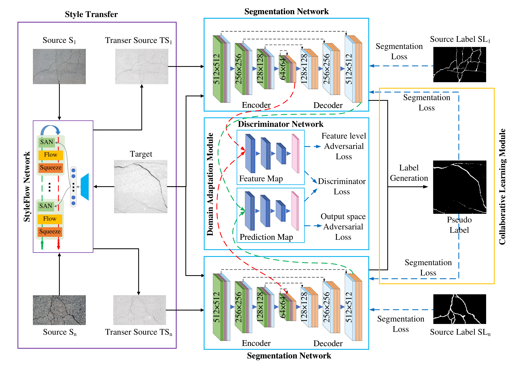

# UDAFractureSeg

This is the official repository for "Unsupervised Domain Adaptation Based Fracture Segmentation Method for Core CT Images". Please cite this work if you find this repository useful for your project.


Segmentation of fractures in Computed Tomography (CT) images of cores is crucial in the analysis of rock physical properties. While supervised learning methods have shown significant success in fracture detection, their performance heavily depends on large labeled datasets. However, labeling images is time-consuming and prone to human error. Moreover, these methods often struggle to effectively generalize to unseen datasets due to differences among source and target images. To address this issue, this paper proposes an unsupervised domain-based adaptive segmentation method for shale fractures. The method consists of two parts: StyleFlow-based Style Transfer and Collaborative Learning based Multi-source Domain Adaptation. Firstly, an image style transfer method is introduced to align the images, reducing the difference in gray scale and noise distribution between the source and target domains. Secondly, the Collaborative Learning based Multi-source Domain Adaptation comprises three modules: a segmentation network module, a domain adaptation module, and a collaborative learning module. The segmentation network adopts a modified U-Net with a multi-scale attention mechanism introduced in the encoder part to capture fracture features at different scales in core. Channel and spatial attention mechanisms are also introduced in the decoder part to compensate for loss of spatial structure information caused by downsampling. The domain adaptive module recognizes inter-domain differences and adapts the model with discriminators and adversarial learning to reduce differences in feature or class distributions between source and target domains. The collaborative learning module further corrects unlabeled target domain data using model-generated pseudo-labels, thus improving domain adaptation accuracy. In this way, the segmentation knowledge learned from pavements can be transferred to the core CT image, which enables the adaptive segmentation of core fractures. We conducted experiments on shale datasets from two different geological sources and compared them with existing methods. The results demonstrate that the proposed method exhibits high accuracy and robustness in the segmentation of fractures.




## Usage

### Requirements

```bash
pip install torch==1.10.0+cu111 torchvision==0.11.0+cu111 torchaudio==0.10.0 -f https://download.pytorch.org/whl/torch_stable.html

pip install -r requirements.txt
```

### Training

```bash
python train_road2core.py
```


### Inference

```bash
python inference.py
```


